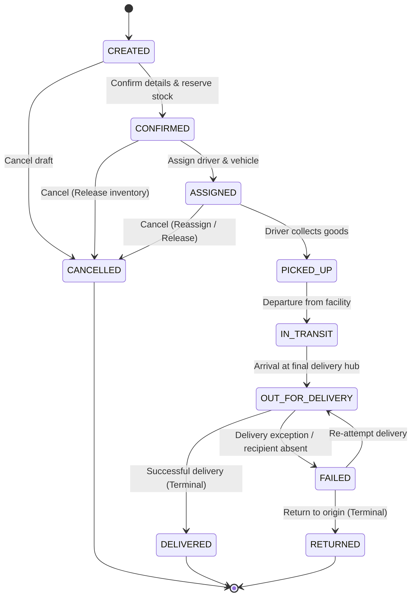

# FlowGrid — Software Requirements Specification (SRS)
**Intelligent Logistics and Supply Chain Management Platform**

---

## 1. Document Overview & Project Vision

### 1.1 Project Summary
**FlowGrid** is an enterprise-grade, intelligent logistics and supply chain management system designed to coordinate end-to-end supply chain workflows: from inventory intake and warehouse management to dispatch, route monitoring, and last-mile delivery tracking.

### 1.2 Technology Stack
The platform uses a modern, decoupled architecture designed for maintainability, developer ergonomics, and cloud-ready deployment:
* **Frontend**: React (v18+) with Vite for fast builds and reactive component state.
* **Backend**: Python 3.11+ using FastAPI (asynchronous, high performance, automatic OpenAPI documentation).
* **Database**: PostgreSQL (relational integrity, ACID compliance, spatial query readiness).
* **ORM & Data Layer**: SQLAlchemy 2.0 (declarative mapping, type safety, beginner-friendly query patterns).
* **Database Migrations**: Alembic (version-controlled database schema changes).
* **Future Machine Learning**: Python with `scikit-learn` (for route efficiency analysis, ETA estimation, and demand forecasting — to be introduced in subsequent phases).
* **Cloud & Infrastructure**: Amazon Web Services (AWS) (target deployment: ECS/Fargate or EC2, Amazon RDS for PostgreSQL, S3 for documents/manifests).

### 1.3 Architecture Principles for Maintainability
Because the backend codebase will be developed with clean, beginner-friendly Python practices, the following design tenets apply:
1. **Layered Separation of Concerns**:
   * **Routers / Endpoints (`api/`)**: Accept HTTP requests, validate input schemas with Pydantic, and return responses.
   * **Service Layer (`services/`)**: Encapsulates core business logic (e.g., state machine checks, inventory reservations).
   * **Data Access / Repositories (`repositories/`)**: Manages SQLAlchemy database queries.
   * **Models (`models/`)**: Pure SQLAlchemy database table definitions.
   * **Schemas (`schemas/`)**: Pydantic models for data validation and serialization.
2. **Explicit over Implicit**: Avoid overly dense metaprogramming; use explicit type annotations, clear function names, and descriptive comments.
3. **Strict Validation**: All API inputs and outputs must be validated through Pydantic models.

---

## 2. User Roles and Access Control (RBAC)

FlowGrid defines four distinct user roles, each with well-defined boundaries of authority:

| Role | Description | Primary Responsibilities |
| :--- | :--- | :--- |
| **Admin** | System administrator with global platform privileges. | User management, role provisioning, system settings, global auditing, and full CRUD across all entities. |
| **Manager** | Logistics and warehouse operations coordinator. | Managing warehouses, product inventories, dispatching shipments, assigning routes & drivers, and reviewing analytical KPIs. |
| **Driver** | Field logistics personnel responsible for physical transport. | Viewing assigned shipments and routes, updating shipment statuses at checkpoints, reporting delivery attempts and exceptions. |
| **Viewer** | Read-only stakeholder (e.g., client, auditor, internal support). | Tracking shipments, viewing public/read-only logs, and inspecting operational reports without modification rights. |

### 2.1 Role-Based Access Control (RBAC) Matrix

| Module / Action | Admin | Manager | Driver | Viewer |
| :--- | :---: | :---: | :---: | :---: |
| **User & Role Management** | CRUD | Read-Only | None | None |
| **Warehouse Management** | CRUD | CRUD | Read-Only (Assigned) | Read-Only |
| **Product & Inventory** | CRUD | CRUD | Read-Only | Read-Only |
| **Driver & Vehicle Profiles** | CRUD | CRUD | Read / Update (Self) | Read-Only |
| **Shipment Creation & Assignment** | CRUD | CRUD | None | Read-Only |
| **Shipment Lifecycle Status Updates**| Full Override | Manage Lifecycle | Progress Lifecycle (Assigned Only) | None |
| **Route Planning & Assignment** | CRUD | CRUD | Read (Assigned) | Read-Only |
| **Operational Analytics & Reports** | Full Access | Full Access | Personal Stats Only | Read-Only |

---

## 3. Core Modules & Functional Requirements

### 3.1 Authentication & RBAC Module
* **User Accounts**:
  * Fields: `id`, `email` (unique), `hashed_password`, `full_name`, `role`, `is_active`, `created_at`, `updated_at`.
* **Security & Tokens**:
  * Secure password hashing using industry standard algorithms (e.g., `bcrypt` or `argon2`).
  * Stateless authentication via JSON Web Tokens (JWT) containing `sub` (user_id) and `role`.
  * FastAPI security dependencies for role verification (`require_role(["admin", "manager"])`).
* **Auditability**:
  * Track user identity on all write operations (`created_by`, `updated_by`).

### 3.2 Warehouse Management Module
* **Warehouse Entity**:
  * Represents physical logistics hubs, fulfillment centers, and transit depots.
  * Fields: `id`, `code` (e.g., `WH-NYC-01`), `name`, `address_line1`, `city`, `state`, `postal_code`, `country`, `latitude`, `longitude`, `total_capacity_sqft`, `is_active`.
* **Zone & Location Management**:
  * Support logical partitions within a warehouse (e.g., Inbound Dock, Bulk Storage, Outbound Staging).
* **Operational Rules**:
  * Warehouses serve as origins and destinations for shipments.
  * Warehouses hold localized inventory balances.

### 3.3 Product and Inventory Management Module
* **Product Catalog**:
  * Fields: `id`, `sku` (unique Stock Keeping Unit), `name`, `description`, `unit_of_measure` (e.g., pieces, kg, pallets), `weight_kg`, `dimensions_cm` (length, width, height), `is_active`.
* **Inventory Balances**:
  * Represents stock levels of a product inside a specific warehouse.
  * Fields: `id`, `warehouse_id`, `product_id`, `quantity_on_hand`, `quantity_reserved`, `reorder_threshold`.
  * **Calculation**: `quantity_available = quantity_on_hand - quantity_reserved`.
* **Inventory Transactions & Audit**:
  * Every inventory alteration (Stock Inbound, Shipment Reservation, Shipment Dispatch, Manual Adjustment) generates an immutable transaction log.

### 3.4 Driver and Vehicle Management Module
* **Driver Profiles**:
  * Fields: `id`, `user_id` (one-to-one relationship with `users` table), `license_number`, `license_expiry`, `phone_number`, `current_status` (`AVAILABLE`, `ON_DUTY`, `IN_TRANSIT`, `OFF_DUTY`), `assigned_vehicle_id`.
* **Vehicle Fleet Registry**:
  * Fields: `id`, `plate_number` (unique), `vin` (unique Vehicle Identification Number), `make`, `model`, `year`, `vehicle_type` (e.g., Van, 18-Wheeler, Refrigerated Truck), `max_weight_capacity_kg`, `max_volume_capacity_cbm`, `status` (`AVAILABLE`, `IN_USE`, `MAINTENANCE`, `DECOMMISSIONED`).
* **Operational Validation**:
  * A vehicle cannot be double-assigned if already marked `IN_USE`.
  * Driver license expiration prevents assignment to active shipments.

### 3.5 Shipment Management Module
* **Shipment Entity**:
  * Represents the commercial and physical unit of goods transported.
  * Fields: `id`, `tracking_number` (unique human-readable code, e.g., `FG-2026-98234`), `origin_warehouse_id`, `destination_type` (Warehouse or Customer Address), `destination_address`, `destination_city`, `destination_state`, `destination_postal_code`, `status` (lifecycle enum), `assigned_driver_id`, `assigned_vehicle_id`, `total_weight_kg`, `total_volume_cbm`, `scheduled_pickup_at`, `delivered_at`, `created_at`, `updated_at`.
* **Shipment Line Items**:
  * Individual product quantities included in the shipment (`shipment_id`, `product_id`, `quantity`).
* **Inventory Locking**:
  * When a shipment is `CONFIRMED`, inventory is transitioned from `available` to `reserved`.
  * When a shipment is `PICKED_UP`, reserved stock is deducted from `quantity_on_hand` and `quantity_reserved`.

### 3.6 Shipment Tracking Module
* **Checkpoint & Audit Log**:
  * Fields: `id`, `shipment_id`, `status`, `location_description`, `latitude`, `longitude`, `remarks`, `recorded_by_user_id`, `recorded_at`.
* **Public & Customer Visibility**:
  * Safe query endpoint by `tracking_number` allowing stakeholders and customers to view shipment progression without revealing sensitive internal details.

### 3.7 Route Management Module
* **Route Definition**:
  * Represents the planned logistical corridor between origin, waypoints, and destination.
  * Fields: `id`, `name`, `origin_warehouse_id`, `destination_warehouse_id` (or delivery zone), `estimated_distance_km`, `estimated_time_minutes`, `is_active`.
* **Route Waypoints / Stops**:
  * Ordered stops for multi-drop or multi-checkpoint delivery manifests.
* **Dispatch Linking**:
  * Links a route with active shipments and assigned drivers.

### 3.8 Analytics Module
* **Key Performance Indicators (KPIs)**:
  * On-Time Delivery Rate (OTD percentage).
  * Shipment status distribution (Active, In Transit, Delivered, Failed, Returned).
  * Warehouse throughput (units inbound vs. outbound).
  * Vehicle capacity utilization and active driver fleet count.
* **Data Scoping**:
  * Managers can filter metrics by warehouse, date range, and status.
  * System-wide aggregated statistics for Admins.

---

## 4. Shipment Lifecycle & State Machine

The shipment lifecycle is governed by a strict state machine to preserve data integrity and prevent illegal status transitions.

### 4.1 Standard Lifecycle States (Happy Path)
1. **`CREATED`**: Shipment draft generated by Manager or Admin; items and destination specified.
2. **`CONFIRMED`**: Shipment details verified; inventory items reserved in origin warehouse.
3. **`ASSIGNED`**: Vehicle and driver allocated to the shipment.
4. **`PICKED_UP`**: Driver arrives at origin, loads freight, and accepts custody; inventory is formally deducted.
5. **`IN_TRANSIT`**: Goods are actively moving along the transit route between logistics nodes.
6. **`OUT_FOR_DELIVERY`**: Shipment has reached the target local zone and is on the final delivery leg to the consignee.
7. **`DELIVERED`**: Goods successfully handed over to consignee; delivery confirmed. Terminal state.

### 4.2 Exception & Terminal States
* **`CANCELLED`**:
  * Shipment abandoned prior to transit.
  * *Allowed From*: `CREATED`, `CONFIRMED`, `ASSIGNED`.
  * *Effect*: Any reserved inventory is released back to `quantity_available`.
* **`FAILED`**:
  * Delivery attempt unsuccessful (e.g., recipient unavailable, premises closed, incorrect address).
  * *Allowed From*: `OUT_FOR_DELIVERY`.
  * *Next Actions*: Can be re-scheduled for another delivery attempt (`OUT_FOR_DELIVERY` or `IN_TRANSIT`) or transitioned to `RETURNED`.
* **`RETURNED`**:
  * Undeliverable goods are transported back to the origin warehouse or return hub.
  * *Allowed From*: `FAILED` or `CANCELLED` (if goods were physically touched).
  * *Effect*: Goods are inspected and re-stocked into inventory. Terminal state.

### 4.3 State Transition Diagram

### 4.4 Transition Rules & Permissions Matrix

| Current State | Target State | Permitted Roles | Required Conditions / Business Logic |
| :--- | :--- | :--- | :--- |
| `CREATED` | `CONFIRMED` | Admin, Manager | Warehouse has sufficient available inventory for all line items. Inventory reserved. |
| `CREATED` | `CANCELLED` | Admin, Manager | No inventory impact. |
| `CONFIRMED` | `ASSIGNED` | Admin, Manager | Driver and Vehicle must both be in `AVAILABLE` status. |
| `CONFIRMED` | `CANCELLED` | Admin, Manager | Reserved inventory is released back to available balance. |
| `ASSIGNED` | `PICKED_UP` | Admin, Driver | Driver confirms receipt. Stock deducted from warehouse on-hand balance. Vehicle marked `IN_USE`. |
| `ASSIGNED` | `CANCELLED` | Admin, Manager | Driver/Vehicle unassigned; inventory reservation released. |
| `PICKED_UP` | `IN_TRANSIT` | Admin, Driver | Driver departs origin facility. Location checkpoint recorded. |
| `IN_TRANSIT` | `OUT_FOR_DELIVERY`| Admin, Driver | Shipment reaches delivery region/destination perimeter. |
| `OUT_FOR_DELIVERY` | `DELIVERED` | Admin, Driver | Consignee signature/proof of delivery recorded. Timestamp saved. |
| `OUT_FOR_DELIVERY` | `FAILED` | Admin, Driver | Failure reason mandatory (e.g., incorrect address, customer unavailable). |
| `FAILED` | `OUT_FOR_DELIVERY`| Admin, Manager | Re-attempt scheduled for next delivery window. |
| `FAILED` | `RETURNED` | Admin, Manager, Driver | Re-attempt threshold exceeded or customer rejected. Stock processed back into warehouse. |

---

## 5. Non-Functional & Engineering Requirements

### 5.1 Beginner-Friendly Code Standards
* **Type Hints**: All function signatures in Python must include explicit arguments and return type hints (e.g., `def get_shipment(shipment_id: int, db: Session) -> Optional[Shipment]:`).
* **Descriptive Naming**: Prefer clear, readable variable and function names over abbreviated jargon (`calculate_available_inventory` vs `calc_avail_inv`).
* **Modular Structure**: Keep files small and focused on a single responsibility (e.g., one model file per domain entity or clear grouped packages).
* **Comprehensive Docstrings**: Every module, class, and service function must have a clear docstring explaining its purpose, inputs, and return values.

### 5.2 Data Integrity & Security
* **Foreign Keys & Constraints**: All relational connections (e.g., `shipment_id`, `warehouse_id`) must have foreign keys and referential integrity configured.
* **Database Transactions**: Multi-step operations (e.g., deducting inventory and transitioning shipment to `PICKED_UP`) must execute inside a single atomic database transaction.
* **Environment Configuration**: Sensitive data (database passwords, JWT secret keys) must be loaded via `.env` files using `pydantic-settings`.

---

## 6. Future Extensibility Roadmap (AI / ML & Cloud)

While no machine learning code or automated optimization will be added during the initial foundation, the architecture is prepared for:
1. **Predictive ETA & Route Optimization**:
   * Storing historical checkpoint timestamps and distances enables training a `scikit-learn` regression model for accurate delivery time estimates.
2. **Inventory Demand Forecasting**:
   * Historical inbound/outbound transaction logs serve as dataset inputs for seasonal inventory replenishment forecasts.
3. **AWS Cloud Readiness**:
   * Stateless backend API allows horizontal scaling on AWS ECS/Fargate behind an Application Load Balancer.
   * PostgreSQL compatibility with AWS RDS Aurora.
   * Object storage (AWS S3) ready for document attachments, proof-of-delivery photos, and shipping labels.
